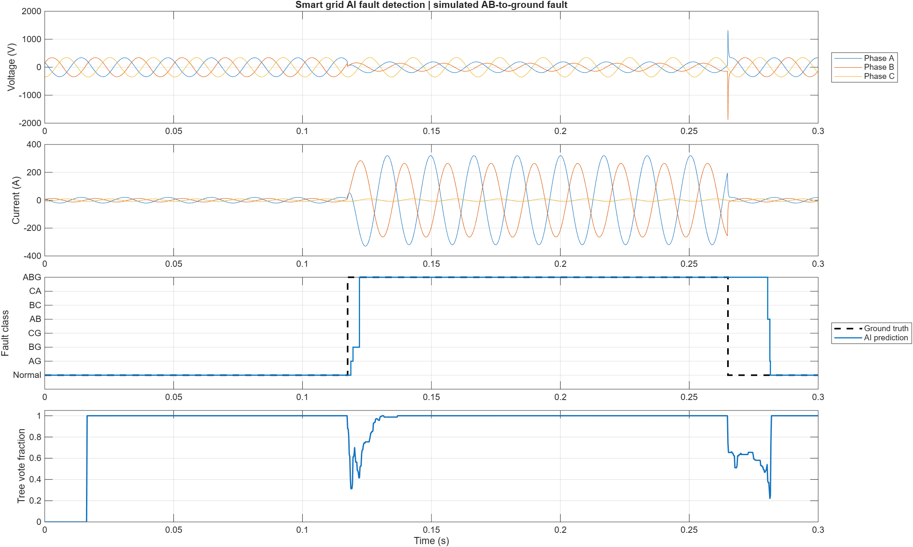
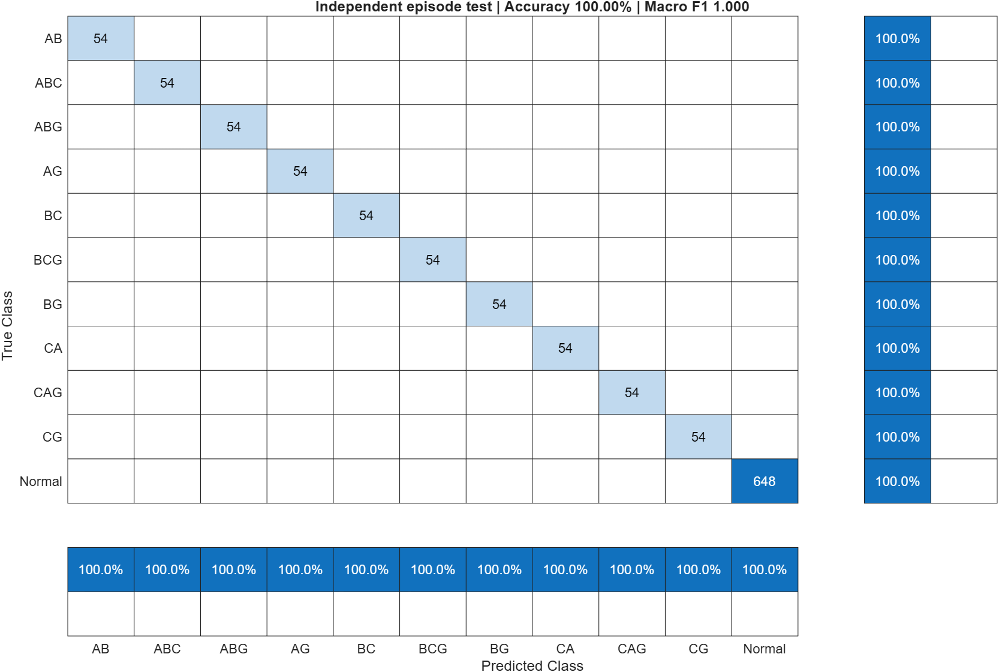
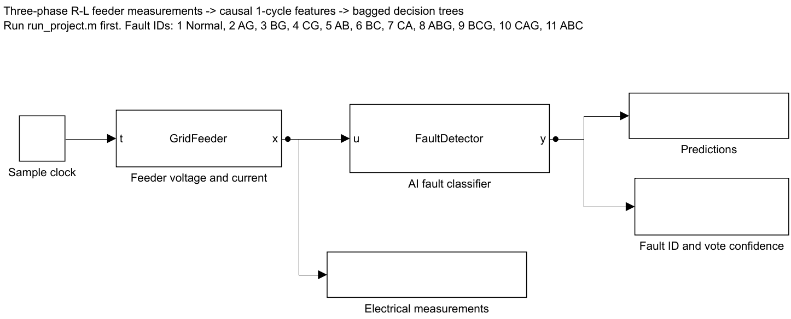

# AI Smart Grid Fault Detection — MATLAB & Simulink

A reproducible three-phase feeder simulation with causal machine-learning fault classification. The Simulink model executes the electrical circuit and AI detector at 4.8 kHz, logs predictions, and displays the fault class and tree vote confidence.



## Run

Tested with MATLAB R2025b on Windows. Requires MATLAB, Simulink, and Statistics and Machine Learning Toolbox. Simscape and Deep Learning Toolbox are not required.

1. Download or clone this repository and open its folder in MATLAB.
2. Run `run_project` to generate data, train the classifier, evaluate independent episodes, rebuild the `.slx` model, simulate an AB-to-ground fault, and export results.
3. Run `open_demo` to open the completed Simulink model, then click **Run**. Double-click the Scope to view the outputs. The MATLAB System blocks use interpreted execution.

The complete run takes several minutes depending on your computer. The included classifier and model allow `open_demo` without retraining. Run from the repository folder so MATLAB can find the entry scripts.

## Electrical model

The reduced feeder has a 230 V RMS phase-to-neutral, 60 Hz three-phase supply, a nominal 0.35 ohm / 2 mH series impedance per phase, and resistive phase-to-neutral loads. It represents an aggregate feeder at a measurement bus rather than a detailed utility network. Each step solves:

```
G = load admittance + fault admittance
a = L / dt
v(k) = [I + (R + a) G(k)]^-1 [source(k) + a i(k-1)]
i(k) = G(k) v(k)
```

Ground faults add shunt conductance. Phase-to-phase faults add coupled conductance entries. Double-phase ground faults combine both. ABC is a symmetric three-phase short without a ground connection. The source neutral is the reference; there is no separate grounding impedance.

The simulator varies source magnitude, phase, frequency, line impedance, load imbalance, fault resistance (0.2–4 ohms), and fault onset. It includes source harmonics, measurement noise, fault clearing, and benign balanced load switching in normal episodes. `GridFeeder` executes the stateful circuit inside Simulink; this is not prerecorded prediction playback.

## AI and evaluation

The model is an ensemble of 80 bagged decision trees. Every prediction uses only the trailing 80 samples (one nominal cycle, 16.67 ms). Features are phase voltage/current RMS, residual voltage/current RMS, phase current peaks, average phase power, and RMS imbalance. Labels, fault parameters, and future samples are never input features.

There are 90 independently randomized episodes per scenario, 990 total. The first 63 episodes per scenario are training episodes; the remaining 27 are held out. Stable normal/fault windows are extracted from each episode. No episode appears in both partitions. Normal windows also come from the pre-fault portions of fault episodes, so class support is unequal; macro F1 and class metrics accompany accuracy.

The bundled run achieved **100% held-out stable-window accuracy** and **1.000 macro F1** on this synthetic distribution. This does not establish accuracy on real grid data, unseen topologies, high-impedance faults outside the modeled range, or transition windows. The demo plot includes onset and clearing transitions that are excluded from stable-window classification metrics. Training and testing use the same circuit family.

The classifier updates at every sample using overlapping causal windows. Early output is Normal with zero confidence until the first complete window. The reported confidence is the largest tree vote fraction, not a calibrated probability. There is no protection relay, automatic trip, or guaranteed detection delay.

| Output ID | Class |
|---:|---|
| 1 | Normal |
| 2 / 3 / 4 | AG / BG / CG |
| 5 / 6 / 7 | AB / BC / CA |
| 8 / 9 / 10 | ABG / BCG / CAG |
| 11 | ABC |

Change the scenario ID in `open_demo.m` to try another class. Edit `src/config.m` to change sample rate, source, duration, or episode count, then retrain. Window extraction in `run_project.m` assumes the default timing; adjust extraction points if duration, frequency, or sampling changes.

## Actual exported results





These PNGs are actual MATLAB/Simulink exports from the executed project. They are suitable for GitHub screenshots; they are not fabricated application screenshots.

| File | Purpose |
|---|---|
| `run_project.m` | Complete reproducible experiment and verification |
| `open_demo.m` | Open the ready-built model with scenario inputs |
| `src/feeder_episode.m` | Reference circuit solver and randomized scenarios |
| `src/GridFeeder.m` | Stateful electrical circuit in Simulink |
| `src/features.m` | Shared causal feature extraction |
| `src/FaultDetector.m` | AI inference in Simulink |
| `src/ai_step.m` | Independent replay verification |
| `src/build_model.m` | Rebuild the Simulink model from source |
| `models/*.slx` | Simulink model |
| `models/classifier.mat` | Trained compact classifier |
| `results/metrics.json` | Run configuration and aggregate metrics |
| `results/class_metrics.csv` | Class support, precision, recall, F1 |
| `results/demo_predictions.csv` | Simulink prediction time series |
| `data/dataset.mat` | Generated features, labels, episode IDs, split |

The run checks that training/test episodes are disjoint, all features and outputs are finite, circuit measurements match the independent numerical reference, and Simulink predictions match an independent causal replay. The generated dataset, full simulation MAT file, trained classifier, CSV/JSON metrics, and screenshots are all included. Rerunning regenerates them. Local logs and build caches are excluded by `.gitignore`.

## Upload to GitHub

Create an empty GitHub repository named `smart-grid-ai`. With Git installed, open a terminal in this folder and run:

```sh
git init
git add .
git commit -m "Add MATLAB and Simulink AI grid fault detection"
git branch -M main
git remote add origin https://github.com/YOUR_USERNAME/smart-grid-ai.git
git push -u origin main
```

Alternatively, use GitHub's **Add file → Upload files** and upload the project contents with their folders. Extract the provided ZIP first; uploading only the ZIP will not display the project README and figures as a browsable repository.

## References

- [MathWorks: classification ensembles](https://www.mathworks.com/help/stats/fitcensemble.html)
- [MathWorks: MATLAB System block](https://www.mathworks.com/help/simulink/slref/matlabsystem.html)
- [MathWorks: printing Simulink diagrams](https://www.mathworks.com/help/simulink/ug/print-model-diagrams.html)

Educational simulation project. Validation on measured grid data and engineering review would be needed before practical protection use.
