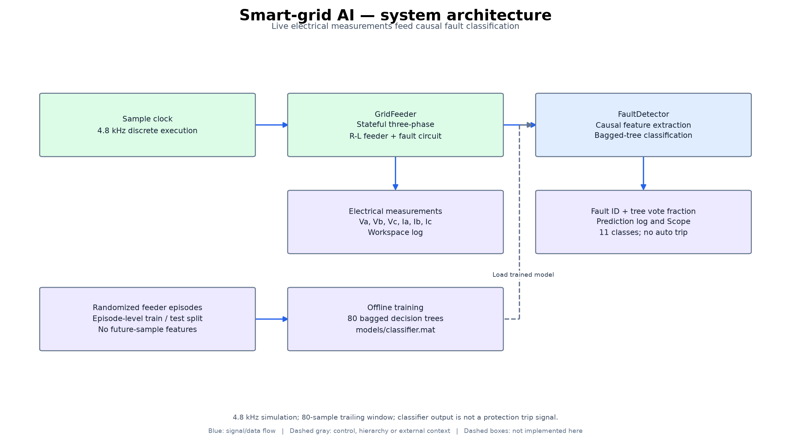
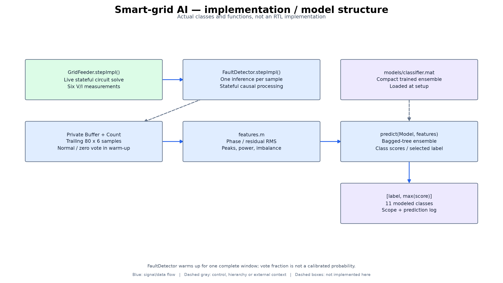
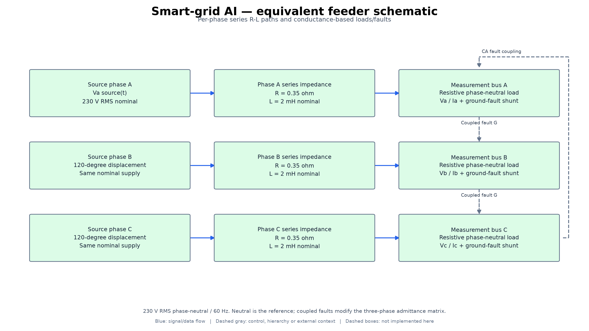

# Architecture and implementation diagrams

Software-executed electrical simulation and ML inference; no FPGA RTL, physical sensor acquisition, relay trip, or real-grid deployment.

These diagrams were derived from the source files linked below. They are
annotated engineering block diagrams, not Vivado synthesized-netlist exports,
application screenshots, PCB schematics, or newly validated hardware.

## system architecture

Live electrical measurements feed causal fault classification.

4.8 kHz simulation; 80-sample trailing window; classifier output is not a protection trip signal.

[Scalable SVG](diagrams/figures/architecture_overview.svg)

## implementation / model structure

Actual classes and functions, not an RTL implementation.

FaultDetector warms up for one complete window; vote fraction is not a calibrated probability.

[Scalable SVG](diagrams/figures/model_structure.svg)

## equivalent feeder schematic

Per-phase series R-L paths and conductance-based loads/faults.

230 V RMS phase-neutral / 60 Hz. Neutral is the reference; coupled faults modify the three-phase admittance matrix.

[Scalable SVG](diagrams/figures/electrical_topology.svg)

## Source mapping and reproduction

Dashed boxes are external integration context, not delivered implementations.
Blue arrows show data/signal flow; dashed gray arrows show control, hierarchy,
or external context. Internal responsibility boxes may represent functions or
register groups rather than separately instantiated modules.

Electrical-topology arrows show reference connections, not a restriction to
one-way power flow. The diagrams summarize mathematical network elements;
they are not construction-ready electrical schematics.

Source files:

- [src/build_model.m](../src/build_model.m)
- [src/config.m](../src/config.m)
- [src/FaultDetector.m](../src/FaultDetector.m)
- [src/features.m](../src/features.m)
- [src/GridFeeder.m](../src/GridFeeder.m)
- [src/feeder_episode.m](../src/feeder_episode.m)
- [run_project.m](../run_project.m)

Source revision: `759f1807c18a81dc4684c270098728285b2ca38f`. The [provenance manifest](diagrams/provenance.json)
records hashes of the inspected source files. No functional source or existing
simulation results were changed for this documentation update.

To regenerate, install `docs/diagrams/requirements.txt` in a separate Python
environment and run `python docs/diagrams/render.py` from the repository root.
The editable block/connection definitions are in [design.json](diagrams/design.json).
